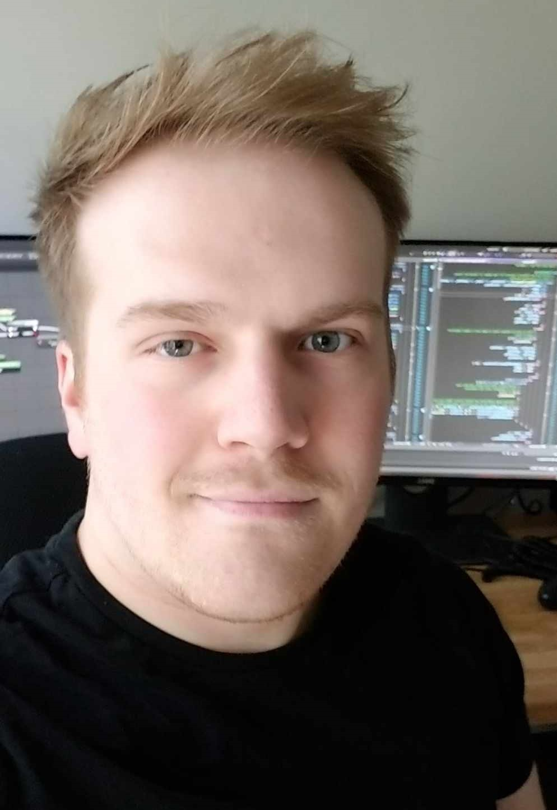

### Start
Intro to Me
===

<!-- column_layout: [1,1] -->
<!-- column: 0-->

You can just just call me Tim.

---
I have a Bachelor's in Computer Science

I started teaching here at UVU right after graduating and have taught here for 3 years 

I worked for Ironwood Experts LLC as a researcher for expert witnesses in patent law

I've written software for JSM Forensics based out of California

I published a research paper at HICSS CSEE&T 2022

<!-- column: 1 -->
<!-- alignment: right -->

<!-- alignment: center -->
_A somewhat decent picture of me_

<!-- end_slide -->

Life of Tim
===
<!-- column_layout: [1,1] -->
<!-- column: 0 -->

I'm was born and raised in West Virginia. I'm a first generation student. 

I had zero background in CS prior to UVU minus a failed attempt at figuring out C++ as a teenager.

Grew up LDS and did a mission in Sao Paulo, Brazil (2013-2015)

Took the Amtrak out west to BYU-I for mechanical engineering.

I met my wife, moved down here to Utah so she could finish her degree at BYU.

I transferred to UVU and changed majors to CS. ME was not for me.

<!-- column: 1 -->

<!-- end_slide -->

Template
===
<!-- column_layout: [1,1] -->
<!-- column: 0 -->

<!-- column: 1 -->

<!-- end_slide -->
